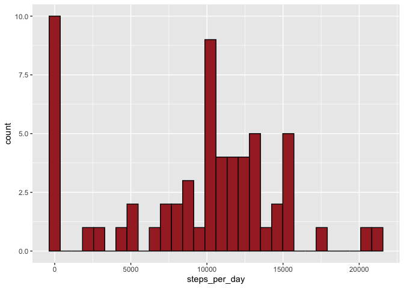
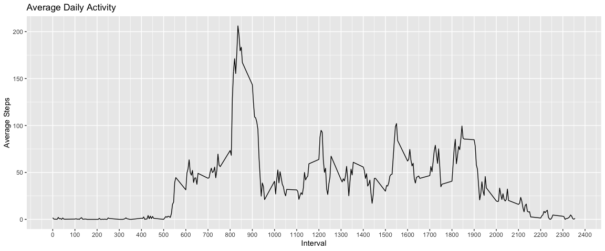
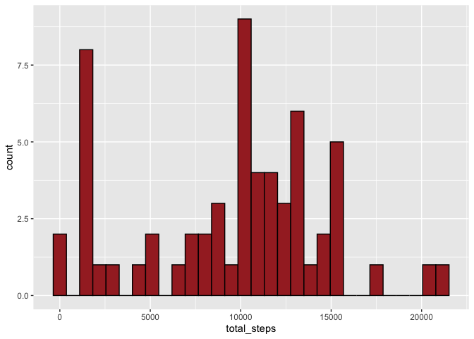
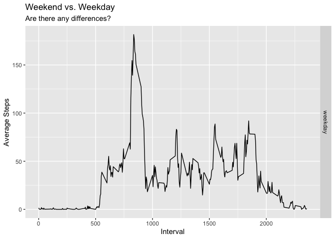

## Loading and preprocessing the data

```r
mydata <- read.csv("./activity.csv", stringsAsFactors = F, header = T)
mydata$date <- as.Date(mydata$date)
str(mydata)
```

```
## 'data.frame':	17568 obs. of  3 variables:
##  $ steps   : int  NA NA NA NA NA NA NA NA NA NA ...
##  $ date    : Date, format: "2012-10-01" "2012-10-01" ...
##  $ interval: int  0 5 10 15 20 25 30 35 40 45 ...
```
## What is mean total number of steps taken per day?

```r
mydata %>% group_by(date) %>% summarise(steps_per_day = sum(steps, na.rm = T))
```

```
## # A tibble: 61 x 2
##    date       steps_per_day
##    <date>             <int>
##  1 2012-10-01             0
##  2 2012-10-02           126
##  3 2012-10-03         11352
##  4 2012-10-04         12116
##  5 2012-10-05         13294
##  6 2012-10-06         15420
##  7 2012-10-07         11015
##  8 2012-10-08             0
##  9 2012-10-09         12811
## 10 2012-10-10          9900
## # … with 51 more rows
```

```r
mydata %>% group_by(date) %>% summarise(steps_per_day = sum(steps, na.rm = T)) %>% 
  ggplot(aes(x = steps_per_day)) +
    geom_histogram(stat = "bin",fill = "brown", color = "black")
```

<!-- -->

```r
mydata %>% group_by(date) %>% summarise(steps_per_day = sum(steps, na.rm = T)) %>% ungroup() %>%
                              summarise(mean = mean(steps_per_day),
                                        median = median(steps_per_day))
```

```
## # A tibble: 1 x 2
##    mean median
##   <dbl>  <int>
## 1 9354.  10395
```

## What is the average daily activity pattern?

```r
mydata %>% group_by(interval) %>% summarise(avg_steps = mean(steps, na.rm = T)) %>% ungroup() %>% 
  ggplot(aes(x = interval, y = avg_steps)) +
    geom_line() +
    scale_x_continuous(breaks = seq(0,2500,100)) +
    labs(title = "Average Daily Activity",
         x = "Interval",
         y = "Average Steps")
```

<!-- -->

From this plot we can see that the **850** interval contains, on average across all the days in the dataset, the maximum number of steps taken.


## Imputing missing values
The total number of missing-values in the dataset is 2304.  
We will fill the NA values with median values for the interval

```r
mydata_no_missing <- mydata %>% group_by(interval) %>% mutate(med_day = median(steps, na.rm = T)) %>% ungroup()
mydata_no_missing$steps[is.na(mydata_no_missing$steps)] <- 
  mydata_no_missing$med_day[is.na(mydata_no_missing$steps)]
```
And the new mean and median of total steps taken per day:

```r
mydata_no_missing %>% group_by(date) %>% summarise(total_steps = sum(steps),
                                                   mean_steps = mean(steps),
                                                   med_steps = median(steps)) %>% 
  ggplot(aes(x = total_steps)) +
    geom_histogram(fill = "brown", color = "black")
```

<!-- -->

It seems there isn't much of an effect for the distribution after imputing the NAs.  

## Are there differences in activity patterns between weekdays and weekends?
Now we will examine if there are differences on weekends vs. rest of the weekdays

```r
mydata_no_missing <- mydata_no_missing %>% mutate(day_of_week = weekdays(date)) %>%
                     mutate(week_time = ifelse(day_of_week %in% c("Friday","Saturday","Sunday"),
                                               "weekend","weekday"))
mydata_no_missing$week_time <- as.factor(mydata_no_missing$week_time)
mydata_no_missing$day_of_week <- NULL

mydata_no_missing %>% group_by(week_time,interval) %>% summarise(avg_steps = mean(steps)) %>% 
  ggplot(aes(x = interval, y = avg_steps)) +
    geom_line() +
    facet_grid(rows = vars(week_time)) +
    labs(title = "Weekend vs. Weekday",
         subtitle = "Are there any differences?",
         x= "Interval",
         y = "Average Steps")
```

<!-- -->


